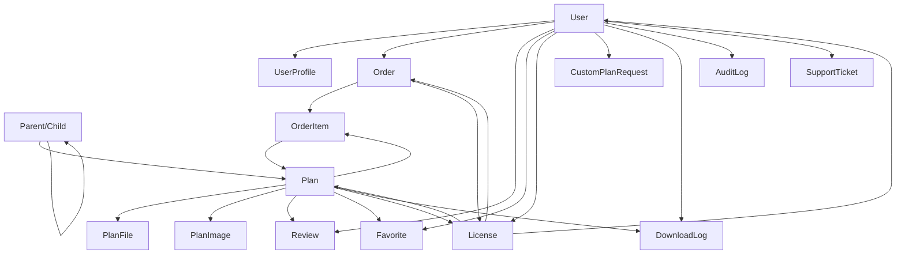

# Pulse Architects Database Schema Overview

## 🏗️ Comprehensive PostgreSQL Schema for E-commerce Platform

This document provides a complete overview of the Pulse Architects database schema, designed specifically for Vercel deployment with advanced e-commerce capabilities for architectural plans.

## 📊 Schema Statistics

- **Total Models**: 18 core models + 5 authentication models
- **Total Enums**: 16 enums for type safety
- **Relationships**: 50+ foreign key relationships
- **Indexes**: 80+ optimized indexes for performance
- **Features**: GDPR compliance, audit logging, multi-tenancy ready

## 🔗 Core Model Relationships



## 📁 Model Categories

### 1. Authentication & User Management (6 models)
- **User**: Core user authentication and profile data
- **UserProfile**: Extended profile information with professional details
- **Account**: OAuth provider accounts (NextAuth.js)
- **Session**: User sessions (NextAuth.js)
- **VerificationToken**: Email verification tokens (NextAuth.js)

**Key Features:**
- GDPR compliance with consent tracking
- Role-based access control (CUSTOMER, ARCHITECT, ADMIN, SUPER_ADMIN)
- Profile completion tracking
- Email preferences management

### 2. Product Catalog (4 models)
- **Category**: Hierarchical categorization system
- **Plan**: Comprehensive architectural plan data
- **PlanFile**: Digital files with security controls
- **PlanImage**: Plan visualization with multiple variants

**Key Features:**
- Hierarchical categories with unlimited nesting
- Comprehensive architectural specifications (square footage, bedrooms, bathrooms, etc.)
- Multi-license pricing (single use, commercial, unlimited)
- SEO optimization with meta tags
- File security with download limits
- Image variants for different use cases

### 3. E-commerce Engine (4 models)
- **Order**: Complete order processing with payment tracking
- **OrderItem**: Individual plan purchases with license types
- **License**: Digital rights management with usage tracking
- **Review**: Customer feedback with moderation system

**Key Features:**
- Multi-item orders with different license types
- Payment status tracking with Stripe integration
- License-based download management
- Review moderation system with verified purchases

### 4. Advanced Features (4 models)
- **CustomPlanRequest**: Custom architecture request workflow
- **Favorite**: User plan favorites with quick access
- **DownloadLog**: Comprehensive download tracking for analytics
- **AuditLog**: System-wide audit trail for compliance
- **SupportTicket**: Integrated customer support system
- **SystemConfig**: Flexible system configuration storage

**Key Features:**
- Custom plan request with architect assignment
- Complete audit trail for compliance
- Integrated support ticket system
- Flexible configuration management

## 🔐 Security & Compliance Features

### GDPR Compliance
```sql
-- User consent tracking
gdprConsent       Boolean   @default(false)
gdprConsentDate   DateTime?
dataRetentionDate DateTime? -- Auto-delete date

-- Email preferences
emailPreferences  Json?     -- Granular email preferences
```

### Audit Logging
```sql
-- Complete audit trail
action      String      -- CREATE, UPDATE, DELETE, DOWNLOAD
entityType  String      -- Plan, Order, User, etc.
entityId    String?     -- ID of affected entity
oldValues   Json?       -- Previous values
newValues   Json?       -- New values
ipAddress   String      -- Request IP
userAgent   String?     -- Browser info
```

### Access Control
```sql
-- Role-based permissions
enum UserRole {
  CUSTOMER      -- Standard customers
  ARCHITECT     -- Plan creators
  ADMIN         -- Site administrators
  SUPER_ADMIN   -- Full system access
}
```

## 🚀 Performance Optimizations

### Strategic Indexing
```sql
-- Search and filtering indexes
@@index([categoryId, style, buildingType, status, isActive])
@@index([squareFootage])
@@index([bedrooms, bathrooms])
@@index([basePrice])
@@index([createdAt desc])

-- User activity indexes
@@index([userId, createdAt desc])
@@index([planId, userId])
@@index([ipAddress])
```

### Optimized Queries
- Efficient pagination with cursor-based navigation
- Strategic eager loading to prevent N+1 queries
- Connection pooling for serverless optimization
- Query result caching at application level

### Vercel Edge Compatibility
- Edge-compatible query patterns
- Connection pooling configuration (`pgbouncer=true`)
- Minimal cold start optimization
- Streaming responses for large datasets

## 💰 E-commerce Specific Features

### License Management
```sql
enum LicenseType {
  SINGLE_USE    -- One-time construction use
  COMMERCIAL    -- Commercial construction rights
  UNLIMITED     -- Unlimited construction rights
  DEVELOPER     -- Multi-project developer license
}

-- Usage tracking
downloadCount     Int         @default(0)
maxDownloads      Int?        -- Null = unlimited
expiresAt         DateTime?   -- License expiration
```

### Pricing System
```sql
-- Flexible pricing structure
basePrice       Decimal       @db.Decimal(10,2)
pricePerSqFt    Decimal?      @db.Decimal(10,4)
licenseOptions  Json          -- {single: price, commercial: price, unlimited: price}
```

### File Management
```sql
-- Secure file storage
cloudinaryUrl String    -- Public URL
secureUrl     String    -- Secure download URL
isSecure      Boolean   @default(true)  -- Requires auth
downloadLimit Int?      -- Max downloads per license
isPreview     Boolean   @default(false) -- Free preview
```

## 📈 Analytics & Tracking

### Plan Performance
```sql
-- Engagement metrics
viewCount       Int           @default(0)
downloadCount   Int           @default(0)
favoriteCount   Int           @default(0)
averageRating   Float?
reviewCount     Int           @default(0)
```

### Download Tracking
```sql
-- Comprehensive download analytics
fileType    FileType
fileName    String
fileSize    BigInt
ipAddress   String
userAgent   String?
licenseType LicenseType?
```

## 🛠️ Development Tools

### Migration System
- Safe migration wrapper with rollback capability
- Migration status tracking in SystemConfig
- Data integrity checks pre/post migration
- Zero-downtime deployment support

### Health Monitoring
- Database health checks with performance metrics
- Slow query detection and analysis
- Data integrity verification
- Automated cleanup utilities

### Seed Data
- Complete sample data for development
- Test users with different roles
- Sample architectural plans with files and images
- System configuration defaults

## 🔧 Integration Points

### NextAuth.js Integration
- Complete authentication setup with Prisma adapter
- OAuth provider support (Google, GitHub)
- Session management with JWT tokens
- Role-based route protection

### Stripe Integration
- Payment processing with order tracking
- Subscription management for recurring plans
- Webhook handling for payment events
- License activation on payment completion

### Cloudinary Integration
- Secure file upload and storage
- Image transformation and optimization
- Signed URLs for protected downloads
- Automatic file optimization

### Email Integration (Resend)
- Transactional email templates
- Order confirmation emails
- License delivery emails
- Support ticket notifications

## 📊 Deployment Configuration

### Vercel Optimization
```json
{
  "functions": {
    "app/api/**/*.ts": {
      "maxDuration": 30
    }
  },
  "build": {
    "env": {
      "ENABLE_EXPERIMENTAL_COREPACK": "1"
    }
  }
}
```

### Environment Variables
```bash
# Database
DATABASE_URL="postgres://...?pgbouncer=true"
DIRECT_URL="postgres://..."

# Authentication
NEXTAUTH_SECRET="..."
NEXTAUTH_URL="https://..."

# Services
CLOUDINARY_CLOUD_NAME="..."
STRIPE_SECRET_KEY="..."
RESEND_API_KEY="..."
```

## 🎯 Use Cases Supported

### Customer Journey
1. **Discovery**: Browse plans by category, style, specifications
2. **Evaluation**: View detailed plans, read reviews, save favorites
3. **Purchase**: Select license type, complete payment
4. **Access**: Download files with license tracking
5. **Support**: Submit tickets, request custom plans

### Architect Workflow
1. **Plan Creation**: Upload plans with detailed specifications
2. **File Management**: Organize files by type and version
3. **Analytics**: Track plan performance and revenue
4. **Custom Requests**: Manage custom plan commissions

### Admin Operations
1. **Content Moderation**: Approve plans and reviews
2. **User Management**: Handle support tickets and user issues
3. **Analytics**: Monitor platform performance and revenue
4. **System Management**: Configure settings and maintain data

## 🚦 Quality Assurance

### Data Validation
- Zod schemas for all input validation
- Database constraints for data integrity
- Business logic validation at application level
- Automated testing for critical workflows

### Performance Testing
- Query performance monitoring
- Load testing for high-traffic scenarios
- Database optimization recommendations
- Automated performance regression detection

### Security Testing
- SQL injection protection via Prisma ORM
- XSS protection with Content Security Policy
- Rate limiting on all public endpoints
- Regular security audits and updates

---

This schema represents a production-ready, scalable foundation for the Pulse Architects e-commerce platform, designed with security, performance, and maintainability as core principles.